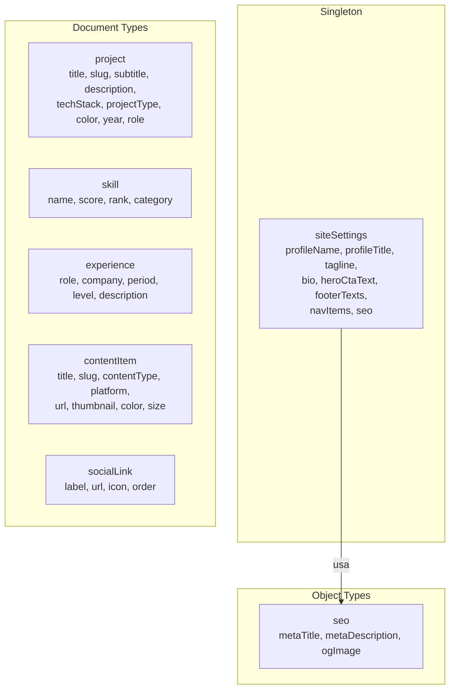

# Arquitetura de Schemas Sanity - LP Eriel Miquilino

## Contexto

O studio Sanity já está inicializado em `[studio/](studio/)` com projectId `g6prtivp` e dataset `production`. O array de schemas em `[studio/schemaTypes/index.ts](studio/schemaTypes/index.ts)` está vazio. Precisamos criar todos os schemas para substituir os dados de `[frontend/src/data/mock.js](frontend/src/data/mock.js)`.

## Estrutura de Diretórios Proposta

Seguindo as boas práticas do Sanity (separar documents, objects, e shared fields):

```
studio/schemaTypes/
├── index.ts                    # Exporta todos os tipos
├── documents/
│   ├── site-settings.ts        # Singleton: dados globais do site
│   ├── project.ts              # Projetos do portfólio
│   ├── skill.ts                # Skills / High Scores
│   ├── experience.ts           # Experiência profissional
│   ├── content-item.ts         # Content Hub (vídeos, artigos, talks)
│   └── social-link.ts          # Links de redes sociais
└── objects/
    └── seo.ts                  # Metadados SEO reutilizáveis
```

---

## Schemas Detalhados

### 1. `siteSettings` (Documento Singleton)

Gerencia textos globais, dados de perfil, navegação e SEO. Será acessado via ID fixo `siteSettings` na Structure do Studio.


| Campo                | Tipo                                                    | Descrição                                        |
| -------------------- | ------------------------------------------------------- | ------------------------------------------------ |
| `profileName`        | `string` (required)                                     | "ERIEL MIQUILINO"                                |
| `profileTitle`       | `string` (required)                                     | "SOFTWARE ARCHITECT"                             |
| `tagline`            | `string`                                                | "Architecting the digital frontier..."           |
| `bio`                | `text`                                                  | Bio do perfil                                    |
| `heroCtaText`        | `string`                                                | Texto do botão CTA (ex: "INSERT COIN")           |
| `footerGameOverText` | `string`                                                | "GAME OVER"                                      |
| `footerCtaText`      | `string`                                                | "Thanks for playing. Insert coin to continue..." |
| `copyrightText`      | `string`                                                | "2025 ERIEL MIQUILINO..."                        |
| `navItems`           | `array` de objetos inline `{id: string, label: string}` | Itens de navegação                               |
| `seo`                | `object` (tipo `seo`)                                   | Metadados SEO globais                            |


### 2. `project` (Documento)

Cada projeto do portfólio.


| Campo         | Tipo                      | Descrição                                             |
| ------------- | ------------------------- | ----------------------------------------------------- |
| `title`       | `string` (required)       | "PIXEL FORGE"                                         |
| `slug`        | `slug` (source: title)    | URL-friendly identifier                               |
| `subtitle`    | `string`                  | "Creative Design Platform"                            |
| `description` | `text` (required)         | Descrição do projeto                                  |
| `techStack`   | `array` de `string`       | ["Next.js", "React", "WebGL"]                         |
| `projectType` | `string` com options.list | "creative" ou "heavy"                                 |
| `color`       | `string`                  | Cor neon do card (hex)                                |
| `year`        | `string`                  | "2024"                                                |
| `role`        | `string`                  | "Lead Architect"                                      |
| `image`       | `image`                   | Imagem/screenshot do projeto (campo novo para futuro) |
| `order`       | `number`                  | Controle de ordenação no Studio                       |


**Decisao sobre Tech Stack:** Usar **array de strings simples** (nao um documento `technology` separado). Justificativa:

- Os dados atuais sao apenas strings simples sem ícone associado
- A complexidade de um documento separado nao se justifica para labels de texto
- Se no futuro quiser ícones/logos por tecnologia, basta criar um documento `technology` e migrar com um script

### 3. `skill` (Documento)

Cada skill no "High Score Board".


| Campo      | Tipo                      | Descrição                                |
| ---------- | ------------------------- | ---------------------------------------- |
| `name`     | `string` (required)       | "SYSTEM DESIGN"                          |
| `score`    | `number` (required)       | 98500                                    |
| `rank`     | `number` (required)       | 1                                        |
| `category` | `string` com options.list | "ARCH", "FE", "BE", "OPS", "DATA", "MOB" |


### 4. `experience` (Documento)

Cada experiência profissional.


| Campo         | Tipo                | Descrição                 |
| ------------- | ------------------- | ------------------------- |
| `role`        | `string` (required) | "Lead Software Architect" |
| `company`     | `string` (required) | "TechCorp Global"         |
| `period`      | `string` (required) | "2022 - PRESENT"          |
| `level`       | `string`            | "LVL 99" (estilo arcade)  |
| `description` | `text`              | Descrição do cargo        |
| `order`       | `number`            | Controle de ordenação     |


### 5. `contentItem` (Documento)

Cada item do Content Hub (vídeos, artigos, talks).


| Campo         | Tipo                                 | Descrição                                           |
| ------------- | ------------------------------------ | --------------------------------------------------- |
| `title`       | `string` (required)                  | "Scaling Microservices to 10M Users"                |
| `slug`        | `slug` (source: title)               | Identificador URL-friendly                          |
| `contentType` | `string` com options.list (required) | "video", "article", "talk"                          |
| `platform`    | `string`                             | "YouTube", "Medium", "Dev.to", "Blog", "Conference" |
| `url`         | `url`                                | Link para o conteúdo externo                        |
| `thumbnail`   | `image`                              | Thumbnail/preview image                             |
| `color`       | `string`                             | Cor neon do card (hex)                              |
| `size`        | `string` com options.list            | "large", "small", "tall", "wide"                    |
| `publishedAt` | `datetime`                           | Data de publicação                                  |


### 6. `socialLink` (Documento)

Links de redes sociais.


| Campo   | Tipo                      | Descrição                                                              |
| ------- | ------------------------- | ---------------------------------------------------------------------- |
| `label` | `string` (required)       | "GitHub"                                                               |
| `url`   | `url` (required)          | URL do perfil                                                          |
| `icon`  | `string` com options.list | Seletor de ícone pré-definido (GitHub, LinkedIn, Twitter, Email, etc.) |
| `order` | `number`                  | Controle de ordenação                                                  |


### 7. `seo` (Object Type)

Objeto reutilizável para metadados SEO.


| Campo             | Tipo     | Descrição                              |
| ----------------- | -------- | -------------------------------------- |
| `metaTitle`       | `string` | Título para metatag                    |
| `metaDescription` | `text`   | Descrição para metatag (max 160 chars) |
| `ogImage`         | `image`  | Imagem Open Graph                      |


---

## Customização do Studio Structure

Atualizar `[studio/sanity.config.ts](studio/sanity.config.ts)` com structure customizada para:

- **Singleton** `siteSettings` no topo (sem permitir criar duplicatas)
- **Divider** visual
- **Listas filtradas** para cada tipo de documento
- Excluir `siteSettings` da lista genérica de documentos

---

## Diagrama da Arquitetura




---

## Resumo de Arquivos a Criar/Modificar

- **Criar:** `studio/schemaTypes/documents/site-settings.ts`
- **Criar:** `studio/schemaTypes/documents/project.ts`
- **Criar:** `studio/schemaTypes/documents/skill.ts`
- **Criar:** `studio/schemaTypes/documents/experience.ts`
- **Criar:** `studio/schemaTypes/documents/content-item.ts`
- **Criar:** `studio/schemaTypes/documents/social-link.ts`
- **Criar:** `studio/schemaTypes/objects/seo.ts`
- **Modificar:** `studio/schemaTypes/index.ts` (registrar todos os tipos)
- **Modificar:** `studio/sanity.config.ts` (adicionar structure customizada com singleton)

